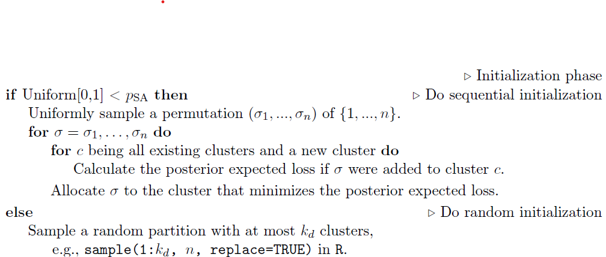

### Setup, load and source

```{r setup}
# Load necessary libraries
library(AntMAN)
library(salso)
library(tidyverse)
library(Rcpp)
library(RcppArmadillo)
library(fossil)
getwd()
source("../src/mixture_utils.R")

```


# Introduction

This notebook documents the step-by-step development of the algorithm for the paper "Clustering by Minimum Distance Estimation" 
Each section corresponds to a component of the R implementation, with toy examples to check correctness.

Following Dahl et al. we design our algorithm similarly to their SALSO paper, albeit with some key differences.

# Simulate data and run Bayesian mixture model
We start by generating samples from a mixture model and use AntMAN to obtain posterior samples.

```{r}
# -----------------------------
# Simulation parameters
# -----------------------------
N <- 100
K <- 3
alpha_0 <- 1

# simdata <- generate_mixture_data(
#   N,
#   K = K,
#   type = "Gaussian",
#   alpha = alpha_0,
#   means = NULL,
#   sds = NULL,
#   skews = NULL
# )

simdata <- generate_mixture_data(
    N,
    K,
    dim = 1,
    alpha = alpha_0,
    mu_true = NULL,      
    Sigma_true = NULL 
)

y <- simdata$data
cluster_true <- simdata$cluster_true
weights_true <- simdata$weights_true

# -----------------------------
# Prior hyperparameters
# -----------------------------
alpha <- 1
kappa_0 <- 1
sig2_0 <- 1
mu_0 <- 0
nu_0 <- 1

# -----------------------------
# MCMC settings
# -----------------------------
n_iter <- 2e4
burn_in <- n_iter / 4
thin <- 10

# -----------------------------
# Define ANTMAN priors & parameters
# -----------------------------
mixture_uvn_params <- AntMAN::AM_mix_hyperparams_uninorm(
  m0 = mu_0, k0 = kappa_0, nu0 = nu_0, sig02 = sig2_0
)

mcmc_params <- AntMAN::AM_mcmc_parameters(
  niter = n_iter, burnin = burn_in, thin = thin, verbose = 1
)

components_prior <- AntMAN::AM_mix_components_prior_pois(Lambda = K)

# weights_prior <- AntMAN::AM_mix_weights_prior_gamma(init = 2, a = 1, b = 1)

# -----------------------------
# Run MCMC and cluster
# -----------------------------
mix_post_draws <- AntMAN::AM_mcmc_fit(
  y = y,
  mix_kernel_hyperparams = mixture_uvn_params,
  mix_components_prior = components_prior,
  # mix_weight_prior = weights_prior,
  mcmc_parameters = mcmc_params
)

eam <- AM_clustering(mix_post_draws)  # M*n matrix

```
Plot the simulated data

```{r}

c_binder <- salso(eam, loss = "binder")
c_vi <- salso(eam, loss = "VI")

plot(y, rep(0,n), col = c_binder, pch = 19)
plot(y, rep(0,n), col = c_vi, pch = 19)

```


# Distance function

The focal point of our paper is the usage of functions that measure the distance between probability distributions, specifically the empirical distribution and the posterior of a mixture model. Since the posterior of a mixture represents a clustering, we can optimize the clustering by minimizing the distance.

The empirical distribution of a dataset $y$ is given by

```{r}

n = length(y)
FN <- rep(0, n) 
for (i in 1:n) { 
   FN[i] <- sum(y <= y[i]) / n 
} 

plot(sort(y), sort(FN2), type = "s")

# Or we could use R's inbuilt ecdf function

test = ecdf(y)
FN[2] == test(y[2])
FN[2];test(y[2])

```
For the purpose of visualization we start with the Kolmogorov Smirnov  distance:

$$
D_{KS} &= \sup_x|F_n(x)-F(x)|
$$

where $F_n(x)$ denotes the empirical distribution and $F(x)$ the cdf of some known parametric distribution. 

We can use the available posterior samples from the AntMAN output


```{r}


m_post = unlist(mix_post_draws$mu[[1]])
w_post = mix_post_draws$W[[1]]
sig2_post = unlist(mix_post_draws$sig2[[1]])


```

We opt to use R's built in ks.test function to get an exact estimate of the KS distance. Note that the function can take samples as input or an actual cdf.

```{r}
# simulate data
set.seed(42)

N <- 100
K <- 3
alpha_0 <- 1

simdata <- generate_mixture_data(
  N,
  K = K,
  type = "Gaussian",
  alpha = alpha_0,
  means = 0,
  sds = 1,
  skews = NULL
)

y <- simdata$data
cluster_true <- simdata$cluster_true
weights_true <- simdata$weights_true

prior_list <- list(
    alpha_0 = 1,       # Dirichlet concentration for mixture weights
    kappa_0 = 1,   
    mu_0    = 0,       # prior mean for component means
    a_0     = 2,       # shape parameter for inverse-gamma prior on variance
    b_0     = 1        # scale parameter for inverse-gamma prior on variance
  )

```

what happens if we give 2 samples to the function:

```{r}
x1 = rnorm(10, 0, 1)
x2 = rnorm(10, 0.1, 1)

ks.test(x1, x2)

```
The function performs an "Exact two-sample Kolmogorov-Smirnov test":

What if we pass the sample and a cdf:

```{r}

ks.test(y, y = mixture_cdf, w = param_post$weights, mean = param_post$mu_post, sig2 = param_post$sigma2_post)


```
We get the "Asymptotic one-sample Kolmogorov-Smirnov test", which src code performs the following:

```{r}

n <- length(x)
# taken from the source code of the function
x <- mixture_cdf(sort(y), weight = param_post$weights,
                     mean = param_post$mu_post,
                     sig2 = param_post$sigma2_post) - (0:(n - 1))/n # subtract the ecdf

# compute the left and right limits since the ecdf is a step function and therefore has 2 values to be compared to at each value x
#c(x, 1/n - x)

max(c(x, 1/n - x))

```
We could potentially manually compare the ecdf with the evaluated mixture cdf, but we should still be cautious about the left and right limit.
Using the evaluated mixture cdf in the ks.test function would be wrong, as well as passing the results of ecdf(y).

Using the correct clustering we get the following metric

```{r}

c_minus <- cluster_true[-10]
c_candidate <- cluster_true
param_post <- mixture_posterior(c_candidate, y, prior_list)
kstat <- as.numeric(ks.test(y, y = mixture_cdf, w = param_post$weights, mean = param_post$mu_post, sig2 = param_post$sigma2_post)$statistic)
print(kstat)
#0.09412532
```

and switching individual items


```{r}
for (k in seq_len(3)) {
  
  c_candidate <- append(c_minus, k, after = i - 1)
  param_post <- mixture_posterior(c_candidate, y, prior_list)
  
  kstat <- as.numeric(ks.test(y, y = mixture_cdf, w = param_post$weights, mean = param_post$mu_post, sig2 = param_post$sigma2_post)$statistic)

  print(kstat)
  
}

```

[1] 0.1052703
[1] 0.1054517
[1] 0.103933

## Wassterstein distance
For now we just accept the cpp functions given by XJ:

```{r}

sourceCpp("../R/W2-functions.cpp")

```


```{r}

compute_distance(data = y, w = w_post, mean = m_post, sig2 = sig2_post, method = "W2")

```
If we plug in the true clustering we get

```{r}

c_candidate <- cluster_true
param_post <- mixture_posterior(c_candidate, y, prior_list)
compute_distance(data = y, w = param_post$weights, mean = param_post$mu_post, sig2 = param_post$sigma2_post, method = "W2")
 
```
Compared to switched items from the sweetening phase:

```{r}

for (k in seq_len(3)){
  
  c_candidate <- append(c_minus, k, after = i - 1)
  param_post <- mixture_posterior(c_candidate, y, prior_list)
  print(compute_distance(data = y, w = param_post$weights, mean = param_post$mu_post, sig2 = param_post$sigma2_post, method = "W2"))
  
}

```


## Pearson distance

Continue here testing the Pearson distance and then integrating it into the compute_distance function.

```{r}

Pearson_mixture_distance(data = y, w = w_post, mean = m_post, sig2 = sig2_post)

compute_distance(data = y, w = w_post, mean = m_post, sig2 = sig2_post, method = "Pearson")

```
If we plug in the true clustering we get

```{r}

c_candidate <- cluster_true
param_post <- mixture_posterior(c_candidate, y, prior_list)
Pearson_mixture_distance(data = y, w = param_post$weights, mean = param_post$mu_post, sig2 = param_post$sigma2_post)

```
Compared to switched items from the sweetening phase:

```{r}

for (k in seq_len(3)){
  
  c_candidate <- append(c_minus, k, after = i - 1)
  param_post <- mixture_posterior(c_candidate, y, prior_list)
  print(Pearson_mixture_distance(data = y, w = param_post$weights, mean = param_post$mu_post, sig2 = param_post$sigma2_post))
  
}

```
significant difference, should work!

# Higher dimensions

Obtaining a meaningful distance measure for higher dimension is no straightforward. Besides the MMD (only started), we explore the Sliced Wasserstein distance, which uses the Radon transform to project both the empirical distribution as well as the mixture on to one dimension, for which we can use the closed form formula of the Wasserstein distance.

## Sliced Wasserstein distance

### Simulate data

```{r}

# -----------------------------
# Simulation parameters
# -----------------------------
N <- 100
K <- 3
alpha_0 <- 1

# simdata <- generate_mixture_data(
#   N,
#   K = K,
#   type = "Gaussian",
#   alpha = alpha_0,
#   means = NULL,
#   sds = NULL,
#   skews = NULL
# )

simdata <- generate_mixture_data(
    N,
    K,
    dim = 3,
    alpha = alpha_0,
    mu_true = NULL,      
    Sigma_true = NULL 
)

y <- simdata$data
cluster_true <- simdata$cluster_true
weights_true <- simdata$weights_true

simdata$Sigma_true

```

### Initialize the mixture

```{r}

K <- 6  # Number of models (number of Gaussians)
d <- 3   # Dimension of the problem

Sigma_samp <- vector("list", K)  # Covariance matrices
mu_samp    <- vector("list", K)  # Means
alphas <- numeric(K)         # weights

for (k in 1:K) {

  Sigma_samp[[k]] <- 0.1 * diag(d)
  mu_samp[[k]]    <- rnorm(d)        
  
}

# Normalize mixture weights
alphas <- rgamma(K, 3, 2)
weight_samp <- alphas/sum(alphas)

```


### Generate slicing directions thetas

```{r}

generateTheta <- function(L, d) {
  theta <- matrix(0, nrow = L, ncol = d)
  
  # First vector: uniform on sphere
  th_l <- runif(d)
  th_l <- th_l / sqrt(sum(th_l^2))
  theta[1, ] <- th_l
  
  # Remaining vectors
  for (i in 2:L) {
    th_l <- rnorm(d)
    th_l <- th_l / sqrt(sum(th_l^2))
    
    m <- max(abs(theta[1:(i - 1), ] %*% th_l))
    
    while (m > 0.97) {
      th_l <- rnorm(d)
      th_l <- th_l / sqrt(sum(th_l^2))
      m <- max(abs(theta[1:(i - 1), ] %*% th_l))
    }
    
    theta[i, ] <- th_l
  }
  
  theta
}

```

### Slice the data

```{r}
theta = generateTheta(L,d)
yproj = y %*% t(theta)

```

### Slice the mixture

For each component we calculate the scalar projection of the covariance matrix and mean vector

```{r}

projectedSigma <- matrix(0, nrow = K, ncol = L)
projectedMu    <- matrix(0, nrow = K, ncol = L)

for (k in 1:K) {
  for (l in 1:L) {
    projectedSigma[k, l] <- sqrt( theta[l, , drop = FALSE] %*% Sigma_samp[[k]] %*% t(theta[l, , drop = FALSE]) )
    projectedMu[k, l]    <- theta[l, , drop = FALSE] %*% mu_samp[[k]]
  }
}


```

Helper functions

Creating a spaced grid t:

```{r}

M = 2e3

#t=np.linspace(-np.abs(Y).max()*np.sqrt(2*d),np.abs(Y).max()*np.sqrt(2*d),T)

t <- seq(
  from = -max(abs(y)) * sqrt(2 * d),
  to   =  max(abs(y)) * sqrt(2 * d),
  length.out = M
)


```


Define own mixture_pdf function

```{r}

mixture_pdf_1D <- function(t, mean, sig2, weight) {
  mix_pdf <-   sapply(t, function(xi) sum(weight * dnorm(xi, mean = mean, sd = sqrt(sig2))))
  mix_pdf / sum(mix_pdf)
}


```

Continue here: decide on how to calculate empirical pdf and cdf, also potentially consider adding a Gaussian kernel as in kde.

```{r}

yproj

emp_pdf <- function(t, proj) {
  # Create histogram with length(t) bins over range of t
  h <- hist(proj,
            breaks = seq(min(t), max(t), length.out = length(t) + 1),
            plot = FALSE)
  
  density <- h$counts
  # Normalize
  density / sum(density)
}

```
The way this function is coded right now it just gives an estimate of the empirical pdf.


### 1D Wasserstein function revisited

```{r}

# def pWasserstein(I0,I1,p):
#     """Given two one-dimensional pdfs I_0 and I_1, this function calculates the following:
#     
#     f:   Transport map between I0 and I1, such that f'I_1(f)=I_0
#     phi: The transport displacement potential f(x)=x-\nabla phi(x)
#     Wp:  The p-Wasserstein distance
#     """
#     assert I0.shape==I1.shape
#     eps=1e-7
#     I0=I0+eps # Add a small value to pdfs to ensure positivity everywhere
#     I1=I1+eps
#     I0=I0/I0.sum() # Normalize the inputs to ensure that they are pdfs
#     I1=I1/I1.sum()
#     J0=np.cumsum(I0) # Calculate the CDFs
#     J1=np.cumsum(I1)
#     # Here we calculate transport map f(x)=x-u(x) 
#     x=np.asarray(range(len(I0))) 
#     xtilde=np.linspace(0,1,len(I0))
#     XI0 = np.interp(xtilde,J0, x)
#     XI1 = np.interp(xtilde,J1, x)
#     u = np.interp(x,XI0,XI0-XI1) # u(x)
#     f = x-u
#     phi= np.cumsum(u/(len(I0))) # Integrate u(x) to obtain phi(x)
#     phi-=phi.mean() # Subtract the mean of phi to account for the unknown constant
#     Wp=(((abs(u)**p)*I0).mean())**(1.0/p)
#     return f,phi, Wp 

```

translated to R

```{r}

Wasserstein_1D <- function(I0, I1, p = 2) {
  stopifnot(length(I0) == length(I1))
  
  eps <- 1e-7
  
  # Ensure strict positivity
  I0 <- I0 + eps
  I1 <- I1 + eps
  
  # Normalize to sum to 1 - both pdfs have already been normalized, so this step is redundant here
  I0 <- I0 / sum(I0)
  I1 <- I1 / sum(I1)
  
  # Compute CDFs
  J0 <- cumsum(I0)
  J1 <- cumsum(I1)
  
  # Grid
  x       <- seq_along(I0) - 1
  xtilde  <- seq(0, 1, length.out = length(I0))
  
  # Inverse CDF sampling (pseudo-quantiles)
  XI0 <- approx(J0, x, xout = xtilde, rule = 2)$y
  XI1 <- approx(J1, x, xout = xtilde, rule = 2)$y
  
  # Displacement field u(x)
  u <- approx(XI0, XI0 - XI1, xout = x, rule = 2)$y
  
  # # Transport map f(x) = x - u(x)
  # f <- x - u
  # 
  # # Potential phi(x)
  # phi <- cumsum(u / length(I0))
  # phi <- phi - mean(phi)
  
  # p-Wasserstein distance
  Wp <- (mean((abs(u)^p) * I0))^(1/p)
  
  Wp
}


```

### Sliced Wasserstein

```{r}

sw = 0

for (l in 1:L){
  RIx = mixture_pdf(t, projectedMu[,l], projectedSigma[,l], weights)
  RIy = emp_pdf(t, yproj[,l])
  sw = sw + pWasserstein(RIx, RIy,p=2) / L
}

sw
```


# Initialization Phase

While SALSO starts with either a
a. Sequential allocation or
b. Uniform initialization of the partition
we start by choosing the partition amongst our posterior draws that minimizes the chosen distance metric. 

{width=99%}

Our version:  
for $j = 1$ to n_samples:  
calculate distance of each sample keep partition c that minimizes W2 distance


```{r}
##| eval: false
##| include: false


# --- 1. KS distance for a mixture ---
KS_distance_mixture <- function(data, w, mean, sig2) {
  mixture_cdf <- function(x) sapply(x, function(xi) sum(w * pnorm(xi, mean = mean, sd = sqrt(sig2))))
  as.numeric(ks.test(data, mixture_cdf)$statistic)
}

# --- 2. Distance wrapper (deprecated) ---
compute_distance <- function(data, w, mean, sig2, method = "KS") {
  if (method == "KS") {
    KS_distance_mixture(data, w, mean, sig2)
  } else {
    stop("Unknown distance method")
  }
}

# --- 3. Initialization phase using your posterior samples ---
initialize_clustering <- function(data,
                                  clustering_matrix,
                                  posterior_params = NULL,
                                  prior_list = NULL,
                                  method = "KS") {
  
  n_candidates <- nrow(clustering_matrix)
  distance <- numeric(n_candidates)
  
  for (i in seq_len(n_candidates)) {
    if (!is.null(posterior_params)) {
      # use given posterior parameters
      w_i    <- posterior_params$w[[i]]
      mu_i   <- posterior_params$mu_post[[i]]
      sig2_i <- posterior_params$sigma2_post[[i]]
    } else {
      # compute posterior parameters from clustering
      c_i <- clustering_matrix[i, ]
      param_post <- mixture_posterior(c_i, data, prior_list)
      w_i    <- param_post$weights
      mu_i   <- param_post$mu_post
      sig2_i <- param_post$sigma2_post
    }
    
    distance[i] <- compute_distance(data, w_i, mu_i, sig2_i, method)
  }
  
  best_index <- which.min(distance)
  D_current <- distance[best_index]
  c_current <- clustering_matrix[best_index,]
  
  return(list(D_current = D_current, c_current = c_current))
}

```
    
Test:

```{r}

# Prepare the AM output for the function
posterior_params <- list(
  w = lapply(mix_post_draws$W, unlist),
  mu_post = lapply(mix_post_draws$mu, unlist),
  sigma2_post = lapply(mix_post_draws$sig2, unlist)
)

clustering_matrix <- eam + 1

# --- Usage ---
init_res <- initialize_clustering(
  data = y,
  clustering_matrix = clustering_matrix,   # list of candidate clusterings
  posterior_params = posterior_params,
  method = "KS"
)

c_current <- init_res$c_current
D_current <- init_res$D_current


```

    
# Sweetening Phase

In this phase we try to find a better clustering by iteratively removing items from their cluster and joining them with either an existing or a new cluster. The order of re-allocation is based on a random permutation.
    
Since the clusterings we are creating in this phase have not been visited by the MCMC Algorithm, we need to write a function to compute the posterior of a mixture model based on these new clusterings.

First versions used posterior means ignoring posterior uncertainty. Current version samples from the posterior and includes option for higher dimensions.
```{r}

# mixture_posterior <- function(c_alloc, data, prior_list) {
#   # Extract priors
#   alpha_0 <- prior_list$alpha_0
#   kappa_0 <- prior_list$kappa_0
#   mu_0    <- prior_list$mu_0
#   a_0     <- prior_list$a_0
#   b_0     <- prior_list$b_0
#   
#   # Number of clusters (assumed labeled 1...K)
#   K <- max(c_alloc)
#   
#   # Preallocate
#   alpha_post  <- numeric(K)
#   mu_post     <- numeric(K)
#   sigma2_post <- numeric(K)
#   
#   for (k in seq_len(K)) {
#     y_k <- data[c_alloc == k]
#     n_k <- length(y_k)
#     
#     # Posterior for weights
#     alpha_post[k] <- alpha_0 + n_k
#     
#     # Posterior for mean
#     kappa_post <- kappa_0 + n_k
#     mu_post[k] <- (kappa_0 * mu_0 + sum(y_k)) / kappa_post
#     
#     # Posterior for variance (# Old code was using mean(y_k) instead of mu_post[k])
#     a_post <- a_0 + 0.5 * (n_k + 1)  # "+1" accounts for mean uncertainty
#     b_post <- b_0 + 0.5 * sum((y_k - mu_post[k])^2) +
#       0.5 * kappa_0 * (mu_post[k] - mu_0)^2
#     
#     sigma2_post[k] <- b_post / (a_post - 1)  # posterior mean of Inv-Gamma
#   }
#   
#   weights_post <- alpha_post / sum(alpha_post)  # expected Dirichlet
#   
#   list(
#     weights_post   = weights_post,
#     mu_post   = mu_post,
#     sigma2_post = sigma2_post
#   )
# }

mixture_posterior <- function(c_alloc, data, prior_list) {
  
  # Extract priors
  alpha_0 <- prior_list$alpha_0
  kappa_0 <- prior_list$kappa_0
  mu_0    <- prior_list$mu_0
  
  n <- nrow(data)
  D <- ncol(data)
  K <- max(c_alloc) # Number of clusters (assumed labeled 1...K)
  
  # Allocate storage
  alpha_post <- numeric(K)
  mu_post <- vector("list", K)
  Sigma_post <- vector("list", K)   # D>1: covariance matrices. D=1: sigma2.
  
  # ---------------------------------------------------------------------
  # CASE 1: UNIVARIATE (D = 1): Normal–Inverse-Gamma
  # ---------------------------------------------------------------------
  if (D == 1) {
    
    a_0     <- prior_list$a_0
    b_0     <- prior_list$b_0
    
    for (k in seq_len(K)) {
      y_k <- data[c_alloc == k]
      n_k <- length(y_k)
      
      # Posterior for weights
      alpha_post[k] <- alpha_0 + n_k
      
      ybar <- mean(y_k)
      S <- sum((y_k - ybar)^2)    # within-cluster sum of squares
      
      # posterior hyperparams
      kappa_post <- kappa_0 + n_k
      mu_n    <- (kappa_0 * mu_0 + n_k * ybar) / kappa_post
      a_post     <- a_0 + 0.5 * n_k
      b_post     <- b_0 + 0.5 * S + (kappa_0 * n_k) / (2 * kappa_post) * (ybar - mu_0)^2
      
      # sample variance then mean
      Sigma_post[[k]] <- 1 / rgamma(1, shape = a_post, rate = b_post)    # Inv-Gamma sample
      mu_post[[k]] <- rnorm(1, mean = mu_n, sd = sqrt(Sigma_post[[k]] / kappa_post))
      
    }
  
    # ---------------------------------------------------------------------
    # CASE 2: MULTIVARIATE (D > 1): Normal–Inverse-Wishart
    # ---------------------------------------------------------------------
    } else {
      
      nu_0 <- prior_list$nu_0
      S_0  <- prior_list$S_0
      
      for (k in seq_len(K)) {
        y_k <- data[c_alloc == k, , drop = FALSE]
        n_k <- nrow(y_k)
        
        # Posterior for weights
        alpha_post[k] <- alpha_0[k] + n_k
        
        # Means
        y_bar <- colMeans(y_k)
        diff <- sweep(y_k, 2, y_bar)
        S_k_data <- t(diff) %*% diff
        
        # Posterior mean of the mean
        kappa_post <- kappa_0 + n_k
        mu_post_k <- (kappa_0 * mu_0 + n_k * y_bar) / kappa_post
        
        nu_post <- nu_0 + n_k
        cross_term <- (kappa_0 * n_k / kappa_post) * tcrossprod(y_bar - mu_0) 
        S_k_post <- S_0 + S_data + cross_term
        
        # sample Sigma (Inv-Wishart) then mu | Sigma
        Sigma_post[[k]] <- MCMCpack::riwish(nu_post, S_k_post)
        mu_post[[k]] <- MASS::mvrnorm(1, mu_post_k, Sigma / kappa_post)
      }
    } 
    
  weights_post <- as.numeric(MCMCpack::rdirichlet(1, alpha_post))
  
  list(
    weights_post   = weights_post,
    mu_post   = mu_post,
    Sigma_post = Sigma_post
  )
}

```


```{r}

sweetening <- function(c_current, data, prior_list, D_current,
                       max_sweet_iter = 100, tol = 1e-10, method = "KS") {
  
  n_cluster <- max(c_current)
  n_sweet <- 0
  
  while (n_sweet < max_sweet_iter) {
    n_sweet <- n_sweet + 1
    
    # Loop over subjects in random order
    random_perm <- sample(seq_along(c_current))
    
    for (i in random_perm) {
      c_minus <- c_current[-i]
      n_cluster <- max(c_minus) + 1
      losses <- numeric(n_cluster)
      
      for (k in seq_len(n_cluster)) {
        c_candidate <- append(c_minus, k, after = i - 1)
        param_post <- mixture_posterior(c_candidate, data, prior_list)
        losses[k] <- compute_distance(data,
                                      w = param_post$weights,
                                      mean = param_post$mu_post,
                                      sig2 = param_post$sigma2_post,
                                      method = method)
      }
      
      # Reassign i
      c_current[i] <- which.min(losses)
    }
    
    D_new <- min(losses)
    
    if (abs(D_new - D_current) < tol) {
      D_current <- D_new
      break
    }
    
    D_current <- D_new
  }
  
  return(list(c_current = c_current, D_current = D_current, n_sweet = n_sweet))
}


```
    
## Test in 1D (old)

```{r}

# Example prior list for a univariate Gaussian mixture
prior_list <- list(
  alpha_0 = 1,       # Dirichlet concentration for mixture weights
  kappa_0 = 0.01,    # pseudo-count for mean prior
  mu_0    = 0,       # prior mean for component means
  a_0     = 2,       # shape parameter for inverse-gamma prior on variance
  b_0     = 1        # scale parameter for inverse-gamma prior on variance
)

# best_init_index <- init_res$best_index
# D_current <- init_res$D_current
# c_current <- eam[best_init_index, ]

sweet_res <- sweetening(c_current, data = y, prior_list, D_current,
                       max_sweet_iter = 100, tol = 1e-10, method = "KS")

```

# Cluster resilience a.k.a. Zealous Updates Phase
    
```{r}

fulfill_gap_label <- function(c_vec){
  # relabel c_vec to make sure there are no empty clusters
  n_unique_label = length(unique(c_vec))
  n_cluster = max(c_vec)
  if(n_unique_label==n_cluster){
    return(c_vec)
  }else{
    label_unique = unique(c_vec)
    c_vec_relabel = rep(NA,length(c_vec))
    for (i in 1:length(c_vec)) {
      c_vec_relabel[i] = which(label_unique == c_vec[i])
    }
    return(c_vec_relabel)
  }
}

```
    
    
```{r}

merge_split_phase <- function(c_current,
                              D_current,
                              data,
                              prior_list,
                              n_max   = 1,
                              n_merge = 1,
                              n_split = 1,
                              method  = "KS") {
  
  n_cluster <- max(c_current)
  n_merge_accept <- 0
  n_split_accept <- 0
  
  if (n_max > 0) {
    for (iter in seq_len(n_max)) {
      
      # --- Merging step ---
      if (n_cluster > 1) {
        pairs <- t(combn(1:n_cluster, 2))
        merge_pairs <- pairs[sample(nrow(pairs), min(n_merge, nrow(pairs))), , drop = FALSE]
        
        for (j in seq_len(nrow(merge_pairs))) {
          clusters_to_merge <- merge_pairs[j, ]
          c_merge <- c_current
          c_merge[c_merge == clusters_to_merge[1]] <- clusters_to_merge[2]
          c_merge <- fulfill_gap_label(c_merge)
          
          param_post <- mixture_posterior(c_merge, data, prior_list)
          D_new <- compute_distance(data,
                                    w    = param_post$weights,
                                    mean = param_post$mu_post,
                                    sig2 = param_post$sigma2_post,
                                    method = method)
          if (D_new < D_current) {
            c_current <- c_merge
            n_cluster <- max(c_current)
            D_current <- D_new
            n_merge_accept <- n_merge_accept + 1
          }
        }
      }
      
      # --- Splitting step ---
      c_split <- c_current
      
      for (j in seq_len(min(n_split, n_cluster))) {
        cl_to_split <- sample(1:n_cluster, 1)
        idx_split <- which(c_current == cl_to_split)
        
        # random binary split
        for (i in idx_split) {
          if (runif(1) < 0.5) {
            c_split[i] <- n_cluster + 1
          }
        }
        c_split <- fulfill_gap_label(c_split)
        
        param_post <- mixture_posterior(c_split, data, prior_list)
        D_new <- compute_distance(data,
                                  w    = param_post$weights,
                                  mean = param_post$mu_post,
                                  sig2 = param_post$sigma2_post,
                                  method = method)
        if (D_new < D_current) {
          c_current <- c_split
          n_cluster <- max(c_current)
          D_current <- D_new
          n_split_accept <- n_split_accept + 1
        }
      }
    }
  }
  
  list(
    c_current      = c_current,
    D_current      = D_current,
    n_cluster      = n_cluster,
    n_merge_accept = n_merge_accept,
    n_split_accept = n_split_accept
  )
}

```

### Test in 1D


```{r}

c_current = sweet_res$c_current

m_s_res <- merge_split_phase(c_current, D_current,
                              data = y,
                              prior_list,
                              n_max   = 1,
                              n_merge = 1,
                              n_split = 1,
                              method  = "KS")

m_s_res$c_current

```

    
# Main function

Putting it all together, the following function computes full runs of the Algorithm.

```{r}

# Main clustering
run_clustering <- function(data,
                           clustering_matrix,
                           posterior_draws,   
                           prior_list,
                           method         = "KS",
                           n_runs         = 10,
                           max_sweet_iter = 100,
                           tol            = 1e-10,
                           n_max          = 1,
                           n_merge        = 1,
                           n_split        = 1) {
  
  # storage (per-run)
  distance_record <- numeric(n_runs)           # stores current distance after each run
  total_accepted_sweets <- integer(n_runs)
  total_accepted_merges <- integer(n_runs)           # accepted merges per run
  total_accepted_splits <- integer(n_runs)           # accepted splits per run


  for (run in seq_len(n_runs)) {
    print(run)
    ## ---------------------------
    ## 1) Initialization phase
    ## ---------------------------
    init_res <- initialize_clustering(
      data = y,
      clustering_matrix = clustering_matrix,   # list of candidate clusterings
      posterior_params = posterior_params,
      method = "KS"
    )

    c_current <- init_res$c_current
    D_current  <- init_res$D_current
    
    ## ---------------------------
    ## 2) Sweetening phase
    ## ---------------------------
    sweet_res <- sweetening(
      c_current   = c_current,
      data        = data,
      prior_list  = prior_list,
      D_current   = D_current,
      max_sweet_iter = max_sweet_iter,
      tol         = tol,
      method      = method
    )
    c_current <- sweet_res$c_current
    D_current <- sweet_res$D_current
    total_accepted_sweets[run] <- sweet_res$n_sweet

    ## ---------------------------
    ## 3) Merge–Split phase
    ## ---------------------------
    ms_res <- merge_split_phase(
      c_current  = c_current,
      D_current  = D_current,
      data       = data,
      prior_list = prior_list,
      n_max      = n_max,
      n_merge    = n_merge,
      n_split    = n_split,
      method     = method
    )

    # update clustering and distance
    c_current <- ms_res$c_current
    D_current <- ms_res$D_current
    # record accepted merges/splits
    total_accepted_merges[run] <-  ms_res$n_merge_accept
    total_accepted_splits[run] <- ms_res$n_split_accept 

    # record distance
    distance_record[run] <- D_current
  }

  # return final clustering and diagnostics
  list(
    clustering = c_current,
    distance_record = distance_record,         
    total_accepted_merges = total_accepted_merges,
    total_accepted_splits = total_accepted_splits,
    total_accepted_sweets = total_accepted_sweets
  )
}


```

### Test in 1D

```{r}

# Example prior list for a univariate Gaussian mixture
prior_list <- list(
  alpha_0 = 1,       # Dirichlet concentration for mixture weights
  kappa_0 = 1,    # pseudo-count for mean prior
  mu_0    = 0,       # prior mean for component means
  a_0     = 2,       # shape parameter for inverse-gamma prior on variance
  b_0     = 1        # scale parameter for inverse-gamma prior on variance
)

# Prepare the AM output for the function
posterior_params <- list(
  weight = lapply(mix_post_draws$W, unlist),
  mu_post = lapply(mix_post_draws$mu, unlist),
  sigma2_post = lapply(mix_post_draws$sig2, unlist)
)

clustering_matrix <- eam + 1

results <- run_clustering(data = y,
               clustering_matrix = clustering_matrix,
               posterior_draws,   
               prior_list,
               method         = "KS",
               n_runs         = 10,
               max_sweet_iter = 100,
               tol            = 1e-10,
               n_max          = 1,
               n_merge        = 1,
               n_split        = 1)

results$clustering

```

### Test in higher dimensions

Continue here by adapting AntMAN for higher dimensions.

```{r}
# -----------------------------
# Simulation parameters
# -----------------------------
N <- 100
K <- 3
alpha_0 <- 1

# simdata <- generate_mixture_data(
#   N,
#   K = K,
#   type = "Gaussian",
#   alpha = alpha_0,
#   means = NULL,
#   sds = NULL,
#   skews = NULL
# )

simdata <- generate_mixture_data(
    N,
    K,
    dim = 3,
    alpha = alpha_0,
    mu_true = NULL,      
    Sigma_true = NULL 
)

y <- simdata$data
cluster_true <- simdata$cluster_true
weights_true <- simdata$weights_true
Sigma_true <- simdata$Sigma_true

# -----------------------------
# Prior hyperparameters
# -----------------------------
alpha <- 1
kappa_0 <- 1
sig2_0 <- 1
mu_0 <- 0
nu_0 <- 1

# -----------------------------
# MCMC settings
# -----------------------------
n_iter <- 2e4
burn_in <- n_iter / 4
thin <- 10

# -----------------------------
# Define ANTMAN priors & parameters
# -----------------------------
mixture_uvn_params <- AntMAN::AM_mix_hyperparams_uninorm(
  m0 = mu_0, k0 = kappa_0, nu0 = nu_0, sig02 = sig2_0
)

mcmc_params <- AntMAN::AM_mcmc_parameters(
  niter = n_iter, burnin = burn_in, thin = thin, verbose = 1
)

components_prior <- AntMAN::AM_mix_components_prior_pois(Lambda = K)

# weights_prior <- AntMAN::AM_mix_weights_prior_gamma(init = 2, a = 1, b = 1)

# -----------------------------
# Run MCMC and cluster
# -----------------------------
mix_post_draws <- AntMAN::AM_mcmc_fit(
  y = y,
  mix_kernel_hyperparams = mixture_uvn_params,
  mix_components_prior = components_prior,
  # mix_weight_prior = weights_prior,
  mcmc_parameters = mcmc_params
)

eam <- AM_clustering(mix_post_draws)  # M*n matrix

```

```{r}

# Example prior list for a univariate Gaussian mixture
prior_list <- list(
  alpha_0 = 1,       # Dirichlet concentration for mixture weights
  kappa_0 = 1,    # pseudo-count for mean prior
  mu_0    = 0,       # prior mean for component means
  a_0     = 2,       # shape parameter for inverse-gamma prior on variance
  b_0     = 1        # scale parameter for inverse-gamma prior on variance
)

# Prepare the AM output for the function
posterior_params <- list(
  weight = lapply(mix_post_draws$W, unlist),
  mu_post = lapply(mix_post_draws$mu, unlist),
  sigma2_post = lapply(mix_post_draws$sig2, unlist)
)

clustering_matrix <- eam + 1

results <- run_clustering(data = y,
               clustering_matrix = clustering_matrix,
               posterior_draws,   
               prior_list,
               method         = "KS",
               n_runs         = 10,
               max_sweet_iter = 100,
               tol            = 1e-10,
               n_max          = 1,
               n_merge        = 1,
               n_split        = 1)

results$clustering

```


# Comparison to old versions:

## Source Xuejins version and my raw version

```{r}

source("C:/Users/alexm/NUS Dropbox/Alexander Mozdzen/distance_clustering/old_code/Salso-functions-generalformat.R")
# new function
source("C:/Users/alexm/NUS Dropbox/Alexander Mozdzen/distance_clustering/old_code/alex_raw/main_raw.R")
source("C:/Users/alexm/NUS Dropbox/Alexander Mozdzen/distance_clustering/old_code/alex_raw/KS-functions-1d_raw.R")


```

## Run all versions

```{r}

c_sample <- apply(eam, 2, function(x) x + 1)

```


```{r}
# prior
prior_list_old = list("alpha" = 1, "kappa0" = 1, "theta" = 0, "a" = 1, "b" = 1)
res_KS_xj = Salso_whole_procedure(eam, y, prior_list_old, KS_distance_mixture, n_runs=3, n_max=3)

res_KS_ax = mde_main(c_sample = clustering_matrix , data = y, prior_list_old,
                     distance_function = KS_distance_mixture,
                     n_runs = 3, n_max = 3, n_split = 3)
```


```{r}
# New:

results <- run_clustering(data = y,
               clustering_matrix = clustering_matrix,
               posterior_params = posterior_params,   
               prior_list,
               method         = "KS",
               n_runs         = 3,
               n_sweet        = 100,
               tol            = 1e-10,
               n_ms_max       = 3,
               n_merge        = 3,
               n_split        = 3)

results$clustering


```


```{r}


adj.rand.index(cluster_true, res_KS_ax)

adj.rand.index(cluster_true, res_KS_xj)

adj.rand.index(cluster_true, results$clustering)


```
```{python}

alex = [1,2,3]


```
    
    
    
    
    
    
    